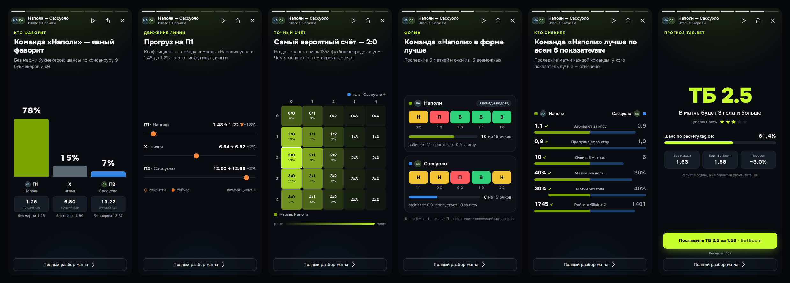

# #tag.bet — теги ставок на футбол

Сайт для заработка на партнёрских программах букмекеров. Берёт матчи, коэффициенты,
статистику, xG, рейтинги Glicko‑2 и травмы из [SStats.net Football API](https://sstats.net/api),
сам считает вероятности без маржи и value, и **ставит каждому матчу теги** простыми словами —
`#выгодно`, `#кэф упал`, `#много голов`, `#обе забьют`, `#может удивить`, `#серия`, `#сильны дома`, `#травмы`…

Тег — это готовая идея для ставки с объяснением «почему» и кнопкой «Ставка» у партнёра.
Отсюда и домен: **tag.bet**.

**Для тех, кто не хочет разбираться в цифрах.** У каждого матча — вывод словами: «Скорее выиграет
«Арсенал»», «Явный фаворит — «Челси»», «Силы равны — 50 на 50». Шансы — процентами с подписью, чей это
шанс (у трёх исходов в сумме ровно 100%, `split100`); исходы — «победа «X»», «3 гола и больше», а не «П1» и «ТБ 2.5»; вместо «перевеса» — «выгода»: букмекер
платит больше, чем стоит исход. Только «скорее» и «вероятно» — это оценка, а не обещание выигрыша.
И только то, что видно по данным: про падение кэфа пишем «снизился: 2.36 → 2.06», а не «на исход несут
деньги» — сколько ставят, мы не знаем.
Логика — `lib/verdict.ts`; на странице матча первым идёт блок «Коротко о матче».


## Как сайт зарабатывает

1. **SEO-трафик.** На каждый матч — отдельная страница с уникальным текстом-прогнозом
   («Прогноз на матч Арсенал — Челси 01.10.2026»), на каждый тег — страница-подборка
   («Тотал больше 2.5: матчи сегодня»), плюс страницы лиг, таблиц и обзоры букмекеров.
2. **Конверсия.** Кнопки ставок стоят там, где решение уже принято: в блоке прогноза,
   в таблице сравнения коэффициентов (у партнёров — кнопка «Ставка»), в sticky‑плашке
   на мобильных, в рейтинге букмекеров.
3. **Учёт.** Все партнёрские ссылки идут через `/go/<букмекер>?p=<место>&m=<матч>`:
   сайт считает клики, а в партнёрку уходит `subid` — видно, какой блок приносит регистрации.

## Что уже работает

- Главная и страницы дней: кружки историй («В игре», «Топ дня» и до пяти главных тегов — подписи без решётки,
  с большой буквы) и «сводка дня» — она занимает весь первый экран: заходишь и сразу видишь главное. Сверху —
  большой блок «Главные матчи»: до пяти важных встреч дня (по важности турнира, по одной на лигу), листаются
  стрелками «1 из 5» в правом верхнем углу (слева в шапке — турнир и тур), без автопрокрутки; чип дня рядом
  («Вчера · Сегодня · Завтра») меняет только сам блок — вчерашние итоги («Фаворит «Ливерпуль» (62%)
  выиграл») и завтрашний анонс. В матче слева — табло строками (эмблема и название, справа время или счёт)
  и под ним «Разбор за минуту» и «Выгодно», справа —
  фраза (до матча — вывод, в игре — «Фаворит «Бетис» (65%) ведёт»), полоса шансов с подписями исходов и
  кэфами и под ней мини-графики: форма команд квадратами В/Н/П, шанс 3+ голов полоской, падение кэфа
  «было → стало» (нет данных — факты словами). Ниже, под маленькой подписью «Цифры дня» (как «Топ-турниры» на странице лиг), — три перехода 1:1:2: «Все матчи» (сколько идёт сейчас), «Ждём
  голов» (пример: «54% — шанс 3+ голов» и матч) и широкий «Кэф упал» («на победу «Хетафе»: 7.67 → 6.34» с
  открытия линии, две точки «было → стало» и «−17%»). «Проверка шансов» — сбываются ли проценты сайта — на
  «Как мы считаем» (`/about#proverka`, `lib/chance-check.ts`). Ниже, по прокрутке, — таблица «Выгодные
  ставки» и «Все матчи дня»: по турнирам (топ-лиги первыми), live-счёт; в строке матча — вывод словами
  («Скорее выиграет «X»»), полоса «кто сильнее», кэфы на хозяев · ничью · гостей с отметкой падения,
  выгодный кэф горит лаймом, теги. Выбор дня — у списка: вкладки «Вчера · Сегодня · Завтра · Вт · Ср»
  (красная точка у «Сегодня», пока идут матчи) и кнопка календаря — любой день за год назад и два месяца
  вперёд; вкладки ведут сразу к списку дня. Порядок — «По турнирам» или «По времени» (по часам).
- Страница матча: «Коротко о матче» словами (кто скорее выиграет, шансы в процентах, голы, падение кэфа,
  выгодная ставка), прогноз tag.bet (шанс, честная цена, выгода, уверенность),
  теги с объяснениями, вероятности 1X2/тоталов/«обе забьют», ожидаемые голы и вероятный
  счёт, сравнение коэффициентов всех букмекеров, авто-текст превью, форма, личные встречи,
  травмы, таблица; для live/завершённых — события и статистика.
- **Матч в слайдах** — клик по матчу открывает «сторис» на весь экран: 6–9 слайдов с анимированными
  графиками (кто фаворит, движение линии, xG и тоталы, тепловая карта точного счёта, форма, сравнение
  «бабочкой», личные встречи, для live/завершённых — голы и статистика) и прогноз с кнопкой партнёра.
- Теги: 13 правил на данных (линия без маржи, модель Пуассона, форма, H2H, травмы, таблица).
- Лиги (таблицы, расписание, результаты), рейтинг и обзоры букмекеров, методология,
  «Ответственная игра».
- SEO: русские названия команд/лиг, title/description под запросы «прогноз на матч…»,
  canonical + 308 на правильный URL, `sitemap.xml`, `robots.txt`, JSON‑LD (SportsEvent,
  BreadcrumbList), OG-картинка.
- Партнёрки: ссылки с `{subid}`, маркировка рекламы (erid), `rel="sponsored"`,
  журнал кликов и `/admin` со статистикой по букмекерам, местам, дням и матчам;
  цель `bk_click` в Яндекс.Метрике.
- Бережное отношение к лимитам API (30 запросов/мин без ключа): кэш stale‑while‑revalidate
  с сохранением на диск, очередь с приоритетами (страницы важнее фоновых задач), фоновый
  прогрев ближайших матчей топ-лиг.
- Демо-режим без сети (`SSTATS_MOCK=1`) с правдоподобными синтетическими данными.


## Матч в слайдах



Клик по любому матчу в списках (главная, дни, теги, «Выгодная ставка», «Другие матчи») открывает сторис
вместо страницы; на странице матча и в «Матче дня» — кнопка «Разбор за минуту».

Наверху главной — кружки историй, как в соцсетях: «В игре», «Топ дня» (самые интересные матчи: турнир,
value, прогрузы, теги) и до пяти главных тегов дня — `#выгодно`, `#кэф упал`, `#много голов`…, остальные —
по «Все теги» (`mainCircles` в `lib/story-groups.ts`). Тап по кружку
листает его матчи по очереди (на обложке — почему матч в этом теге), потом — матчи следующих кружков.
Кольцо разбито на сегменты по числу матчей; просмотренные гаснут по порядку, от верха по часовой стрелке,
а следующий тап продолжает с первого непросмотренного. Каждый кружок помнит своё (браузер зрителя,
отметка «кружок + матч»): один матч бывает в нескольких кружках, и просмотр в «Топ дня» не гасит
`#кэф упал`; открытия из списка матчей и виджетов кольца не трогают. Матч, который уже был раньше
в очереди, в следующем кружке не повторяется, но засчитывается там, когда до него доходишь
(`components/story/queue.ts`).
Без JS и для поисковиков кружок — обычная ссылка на страницу тега. Управление как в соцсетях: тап справа —
дальше, слева — назад, удержание — пауза, свайп вбок — соседний матч, свайп вниз / «Назад» / Esc —
закрыть. На компьютере — стрелки и пробел. Кнопка «Поделиться» даёт ссылку `/match/<…>?story=<id>`:
она открывает страницу матча сразу со сторис — удобно для Telegram.

- Кружки собираются в `lib/story-groups.ts` из матчей дня, без лишних запросов к API.
- Слайды собираются из тех же данных, что и страница матча (`lib/story.ts`, отдаёт `/api/story/<id>`);
  слайд без данных пропускается, а если показывать почти нечего — открывается обычная страница матча.
- Графики — чистые CSS/SVG без библиотек (`components/story/`), с `prefers-reduced-motion` анимации
  отключаются. Цвета «хозяева/гости» (`--color-home`, `--color-away`) проверены на различимость, в том
  числе при дальтонизме; числа и подписи — цветом текста.
- Для поисковиков ссылки остаются обычными ссылками на страницы матчей, Ctrl/Cmd‑клик открывает страницу.
- Кнопка ставки на последнем слайде идёт через `/go/<бк>?p=story` — в партнёрке видно, сколько приносят сторис.

## Бренд

Логотип — одна наклонная лаймовая решётка, без надписи: четыре бруска со скруглёнными углами, наклон
6,5°. Он в шапке и подвале (`LogoMark` в `components/Logo.tsx`), на иконках и в превью ссылок; название
сайта — в заголовке вкладки и подписи ссылки «на главную». Файлы — в `public/brand/`:

| Файл | Где использовать |
| --- | --- |
| `logo.svg` | логотип (решётка) для тёмного фона |
| `logo-black.svg` | одноцветный для светлого фона (документы, печать) |
| `mark.svg` | тот же знак — исходник для `components/logo-paths.ts` |
| `avatar.png` | аватарка Telegram-канала и соцсетей (640×640) |

Иконка вкладки — `app/icon.svg`, иконка для iPhone — `app/apple-icon.png`, превью ссылок — `public/og.png`.
Стиль — «табло»: тёплый почти чёрный фон `#0B0B09`, тёплый белый текст `#F4F1E6`, шрифт Onest, крупные
афишные заголовки и цифры на «перекидных» флапах, как на стадионе. Лайм `#C8FF2E` — маркер «цена выше
честной» (выгодные ставки, горящие коэффициенты) и главная кнопка; прогрузы — янтарные.
Сила перевеса — яркостью того же лайма (чем больше, тем ярче), а не светофором: красный занят под live,
зелёный/красный — только для формы команды (В/Н/П, с буквами). Шапка без полосы: логотип без подложки,
меню-капсула строго по центру с «переезжающим» выбранным разделом, «Бонус» справа; стекло — при прокрутке.

### Обложки историй

Кружки историй на главной — плоские, как карточки: тёмная заливка, тонкая рамка и светлая иконка тега (`lib/story-art.ts`),
цвет только в кольце — лайм, пока историю не смотрели, красный у LIVE, серый — просмотрено. Свою обложку — фото, рисунок, картинку из нейросети — можно подложить файлом
`public/stories/<ключ>.webp` (подойдут и `.jpg`, `.png`, `.avif`; квадрат от 400×400): она встанет в кружок
и фоном в начало истории. Ключи: `live` («В игре»), `top` («Топ дня»), `all` («Все теги») и slug тега —
`value`, `progruz`, `tb-2-5`, `tm-2-5`, `obe-zabyut`, `favorit`, `ravnye`, `andedog`, `seriya`, `krepost`,
`kadry`, `h2h`, `top-match`. Берите только картинки, на которые есть права: свои, сгенерированные или
со стоков со свободной лицензией.

## Быстрый старт (демо, без API)

Нужен Node.js 20.9+.

```bash
npm install
SSTATS_MOCK=1 npm run dev        # http://localhost:3000
```

В демо-режиме внизу страницы, в подвале, есть строка о том, что данные сгенерированы, а `robots.txt`
закрывает сайт от индексации. Полосы над шапкой нет.
Чтобы посмотреть live-матчи в любое время суток, «переведите часы» демо-данных:
`SSTATS_MOCK=1 SSTATS_MOCK_NOW=2026-10-02T19:30:00+03:00 npm run dev`.

Для работы над виджетами — режим, где часы стоят: `SSTATS_MOCK=design npm run dev`. Всегда воскресенье,
4 октября, 19:30: одни и те же матчи во всех состояниях (идут, скоро, сыграны, с выгодной ставкой,
с упавшим кэфом), у главных матчей есть форма команд. К API этот режим не обращается.

Эмблемы команд в демо — настоящие, если один раз выполнить `npm run team-logos` с ключом в `.env.local`:
скрипт берёт команды демо-лиг из SStats (около 11 запросов, по одному на страну) и сохраняет
`.data/team-logos.json`. Без файла вместо эмблем — монограммы. Перезапустите `npm run dev`.

Обновление: `git pull`, затем `npm run dev`. Если в обновлении поменялись зависимости,
`npm run dev` сам выполнит `npm install` (скрипт `scripts/ensure-deps.mjs`).

## Подключение реального SStats API

```bash
cp .env.example .env.local       # SSTATS_MOCK=0 и SSTATS_API_KEY=<ваш ключ>
npm run inspect-api              # проверит ключ, доступ и сохранит сырые ответы в scripts/samples/
npm run build && npm start
```

Ключ храните только в `.env.local` (локально) или `.env` (на сервере) — оба файла в `.gitignore`
и не попадают ни в репозиторий, ни в Docker-образ. С ключом сайт по умолчанию делает до 60 запросов
в минуту (`SSTATS_RPM`); если квота ключа больше — поднимите значение.

> Код разбора рынков написан по OpenAPI-спецификации SStats и терпим к разным
> названиям («Match Winner» / «1X2» / «Исход», «Over 2.5» / «ТБ(2.5)» и т.п.), но на живых
> данных его стоит сверить один раз:
>
> 1. `npm run inspect-api` — покажет букмекеров и названия рынков/исходов;
> 2. `/api/debug/odds?id=<ID матча>&token=<ADMIN_TOKEN>` — как сайт распознал каждый рынок
>    (`recognizedAs`). Если у 1X2/тоталов `null` — поправьте регулярки в `lib/odds.ts`;
> 3. сверьте названия букмекеров с `apiNames` в `config/bookmakers.ts` — от этого зависит,
>    у кого в таблице коэффициентов появится кнопка «Ставка».

## Партнёрские ссылки и маркировка рекламы

Всё задаётся в `.env` (см. `.env.example`), код трогать не нужно:

```env
AFF_FONBET_URL=https://партнёрка.example/click?offer=123&sub1={subid}
AFF_FONBET_ERID=2VtzqvXXXXX
AFF_FONBET_ADVERTISER=ООО «…»
PARTNERS_ORDER=fonbet,winline,pari      # первый — главный (шапка, sticky-кнопка)
ADMIN_TOKEN=длинная-случайная-строка     # /admin?token=…
```

`{subid}` превратится в `место_матч`, например `pick_1234567`, `odds-table_1234567` или `story_1234567`.
Тексты бонусов, рейтинг, плюсы/минусы и список букмекеров — в `config/bookmakers.ts`
(сейчас там нейтральные формулировки: подставьте актуальные условия из партнёрки).

## Деплой на VPS (Docker)

Хватит VPS на 1 vCPU / 1 ГБ RAM.

```bash
git clone <repo> tagbet && cd tagbet
cp .env.example .env && nano .env      # SITE_URL, ссылки партнёров, ADMIN_TOKEN, Метрика
docker compose up -d --build           # сайт на 127.0.0.1:3000
```

HTTPS через Caddy (`/etc/caddy/Caddyfile`):

```
tag.bet {
  encode zstd gzip
  reverse_proxy 127.0.0.1:3000
}
www.tag.bet {
  redir https://tag.bet{uri} permanent
}
```

Кэш API и журнал кликов лежат в Docker-томах и переживают обновления.
Мониторинг — `GET /api/health`. На Vercel тоже запустится, но кэш, лимитер и фоновый
прогрев там живут внутри отдельных инстансов, поэтому для работы с лимитами API лучше VPS.

## После запуска (SEO)

1. Яндекс.Вебмастер и Google Search Console: добавить сайт, указать `https://tag.bet/sitemap.xml`,
   прописать `YANDEX_VERIFICATION` / `GOOGLE_SITE_VERIFICATION`.
2. Яндекс.Метрика: `YANDEX_METRIKA_ID`, цель «JavaScript-событие» `bk_click`.
3. Расширять словарь русских названий в `lib/i18n/ru.ts` под лиги, которые приносят трафик.

## Структура

```
app/                    страницы (App Router): /, /matches/[date], /match/[slug], /tag/[slug],
                        /tags, /leagues, /league/[slug], /bookmakers, /go/[slug], /admin, sitemap, robots
components/             UI (строка матча, таблица кэфов, блок прогноза, sticky-CTA…)
config/bookmakers.ts    партнёры: ссылки, бонусы, рейтинг, erid, сопоставление с API
config/leagues.ts       топ-турниры и их порядок
lib/sstats/             клиент API, типы ответов, нормализация, демо-данные
lib/data.ts             получение данных с кэшем + сборка «инсайтов» матча
lib/odds.ts             разбор рынков, снятие маржи
lib/model.ts            консенсус рынка, модель Пуассона, value, выбор прогноза
lib/tags.ts             правила тегов
lib/preview.ts          генерация текста превью
lib/story.ts            данные для «Матча в слайдах» (components/story/ — просмотр и графики)
lib/story-groups.ts     кружки историй на главной; lib/rank.ts — «интересность» матча
lib/cache.ts, rate-limit.ts, warmer.ts   кэш, лимитер запросов, фоновый прогрев
lib/clicks.ts, affiliate.ts              журнал кликов и партнёрские ссылки
lib/chance-check.ts     «Проверка шансов»: давали — сбылось за месяц
scripts/inspect-api.mjs проверка реального API
scripts/team-logos.mjs  эмблемы команд для демо (.data/team-logos.json)
tests/                  тесты (npm test)
```

Проверки: `npm run typecheck`, `npm test`, `npm run build`.

## Идеи развития (по отдаче)

1. **Telegram-канал + бот** — автопостинг `#value` и `#прогруз` с реф-ссылкой. В русскоязычном
   беттинге это основной источник трафика помимо поиска; данные и теги уже есть.
2. **Live-раздел** — live-кэфы SStats (`/Odds/live`) и PARI (`/Pari/*`, обновление раз в 3 с):
   «матчи, где сейчас прогрузили гол» — сильный повод перейти к букмекеру прямо в игре.
3. **ИИ-превью топ-матчей** (например, Claude API) поверх уже собранных данных — длинные
   уникальные тексты для самых частотных запросов.
4. **Конкурс прогнозов / трекер ставок** с рейтингом игроков — возвращаемость и UGC.
5. **Страницы команд и игроков** (`/Teams`, `/Players`) — длинный хвост SEO.
6. **Графики движения линии** (`/Odds/live-changes`, `/Pari/odds/history`) — наглядные «прогрузы».
7. **Экспресс дня** из матчей с тегами и кнопкой «Собрать в БК».
8. **Подписка на теги любимых команд** (push/e-mail).
9. **Гео-офферы** (RU/KZ/UZ…) и A/B-тесты кнопок по данным `/admin` и постбэкам партнёрок.

## Важно (юридически)

- Сайт для 18+; дисклеймеры и страница «Ответственная игра» уже есть.
- В России рекламировать можно только легальных букмекеров (лицензия ФНС, ЕЦУПИС):
  реклама офшорных контор ведёт к блокировке домена и штрафам.
- Рекламные блоки нужно маркировать: «Реклама», рекламодатель и токен erid — поля для них
  есть в конфиге, токены выдаёт партнёрка.
- Партнёрки обычно требуют согласовывать тексты бонусов — поэтому они вынесены в конфиг.
- Реклама ставок (ст. 27 закона «О рекламе») не должна внушать, что ставки — способ заработка,
  преувеличивать шанс выигрыша или обещать выигрыш. Поэтому на сайте нет «сколько бы вы заработали»
  в рублях: аналитика — в процентах («Проверка шансов»), выводы — только «скорее», «вероятно».

Это не юридическая консультация: сверьтесь с условиями своих партнёрских программ.
