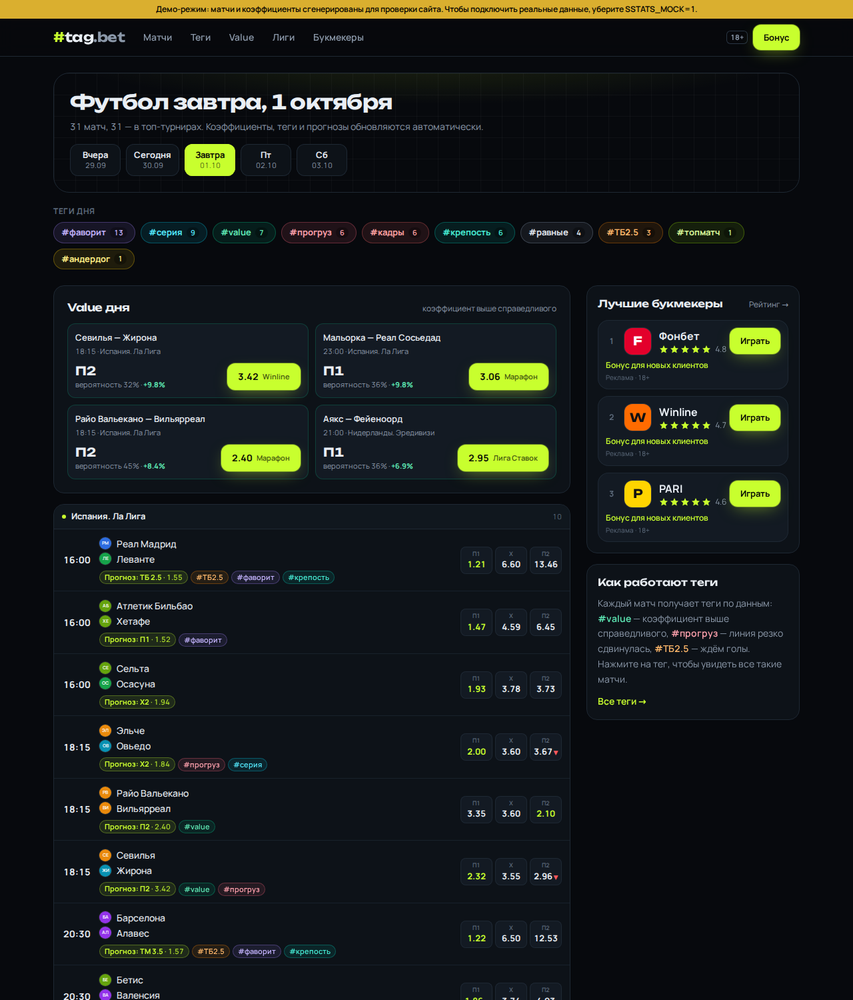
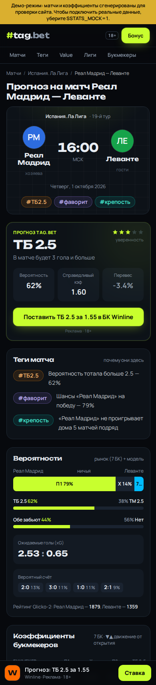

# #tag.bet — теги ставок на футбол

Сайт для заработка на партнёрских программах букмекеров. Берёт матчи, коэффициенты,
статистику, xG, рейтинги Glicko‑2 и травмы из [SStats.net Football API](https://sstats.net/api),
сам считает вероятности без маржи и value, и **ставит каждому матчу теги** —
`#value`, `#прогруз`, `#ТБ2.5`, `#обезабьют`, `#андердог`, `#серия`, `#крепость`, `#кадры`…

Тег — это готовая идея для ставки с объяснением «почему» и кнопкой «Ставка» у партнёра.
Отсюда и домен: **tag.bet**.



## Как сайт зарабатывает

1. **SEO-трафик.** На каждый матч — отдельная страница с уникальным текстом-прогнозом
   («Прогноз на матч Арсенал — Челси 01.10.2026»), на каждый тег — страница-подборка
   («Тотал больше 2.5: матчи сегодня»), плюс страницы лиг, таблиц и обзоры букмекеров.
2. **Конверсия.** Кнопки ставок стоят там, где решение уже принято: в блоке прогноза,
   в таблице сравнения коэффициентов (у партнёров — кнопка «Ставка»), в sticky‑плашке
   на мобильных, в рейтинге букмекеров.
3. **Учёт.** Все партнёрские ссылки идут через `/go/<букмекер>?p=<место>&m=<матч>`:
   сайт считает клики, а в партнёрку уходит `subid` — видно, какой блок приносит регистрации.

## Что уже работает

- Главная и страницы дней: матчи по турнирам (топ-лиги первыми), live-счёт, короткие кэфы
  П1/Х/П2 с отметкой падения, теги и прогноз прямо в строке, «Value дня».
- Страница матча: прогноз tag.bet (вероятность, справедливый кэф, перевес, уверенность),
  теги с объяснениями, вероятности 1X2/тоталов/«обе забьют», ожидаемые голы и вероятный
  счёт, сравнение коэффициентов всех букмекеров, авто-текст превью, форма, личные встречи,
  травмы, таблица; для live/завершённых — события и статистика.
- Теги: 13 правил на данных (линия без маржи, модель Пуассона, форма, H2H, травмы, таблица).
- Лиги (таблицы, расписание, результаты), рейтинг и обзоры букмекеров, методология,
  «Ответственная игра».
- SEO: русские названия команд/лиг, title/description под запросы «прогноз на матч…»,
  canonical + 308 на правильный URL, `sitemap.xml`, `robots.txt`, JSON‑LD (SportsEvent,
  BreadcrumbList), OG-картинка.
- Партнёрки: ссылки с `{subid}`, маркировка рекламы (erid), `rel="sponsored"`,
  журнал кликов и `/admin` со статистикой по букмекерам, местам, дням и матчам;
  цель `bk_click` в Яндекс.Метрике.
- Бережное отношение к лимитам API (30 запросов/мин без ключа): кэш stale‑while‑revalidate
  с сохранением на диск, очередь с приоритетами (страницы важнее фоновых задач), фоновый
  прогрев ближайших матчей топ-лиг.
- Демо-режим без сети (`SSTATS_MOCK=1`) с правдоподобными синтетическими данными.



## Быстрый старт (демо, без API)

Нужен Node.js 20.9+.

```bash
npm install
SSTATS_MOCK=1 npm run dev        # http://localhost:3000
```

В демо-режиме сверху висит жёлтая плашка, а `robots.txt` закрывает сайт от индексации.

## Подключение реального SStats API

```bash
cp .env.example .env.local       # SSTATS_MOCK=0, при желании SSTATS_API_KEY
npm run inspect-api              # проверка доступа + сырые ответы в scripts/samples/
npm run build && npm start
```

> Код разбора рынков написан по OpenAPI-спецификации SStats и терпим к разным
> названиям («Match Winner» / «1X2» / «Исход», «Over 2.5» / «ТБ(2.5)» и т.п.), но на живых
> данных его стоит сверить один раз:
>
> 1. `npm run inspect-api` — покажет букмекеров и названия рынков/исходов;
> 2. `/api/debug/odds?id=<ID матча>&token=<ADMIN_TOKEN>` — как сайт распознал каждый рынок
>    (`recognizedAs`). Если у 1X2/тоталов `null` — поправьте регулярки в `lib/odds.ts`;
> 3. сверьте названия букмекеров с `apiNames` в `config/bookmakers.ts` — от этого зависит,
>    у кого в таблице коэффициентов появится кнопка «Ставка».

## Партнёрские ссылки и маркировка рекламы

Всё задаётся в `.env` (см. `.env.example`), код трогать не нужно:

```env
AFF_FONBET_URL=https://партнёрка.example/click?offer=123&sub1={subid}
AFF_FONBET_ERID=2VtzqvXXXXX
AFF_FONBET_ADVERTISER=ООО «…»
PARTNERS_ORDER=fonbet,winline,pari      # первый — главный (шапка, sticky-кнопка)
ADMIN_TOKEN=длинная-случайная-строка     # /admin?token=…
```

`{subid}` превратится в `место_матч`, например `pick_1234567` или `odds-table_1234567`.
Тексты бонусов, рейтинг, плюсы/минусы и список букмекеров — в `config/bookmakers.ts`
(сейчас там нейтральные формулировки: подставьте актуальные условия из партнёрки).

## Деплой на VPS (Docker)

Хватит VPS на 1 vCPU / 1 ГБ RAM.

```bash
git clone <repo> tagbet && cd tagbet
cp .env.example .env && nano .env      # SITE_URL, ссылки партнёров, ADMIN_TOKEN, Метрика
docker compose up -d --build           # сайт на 127.0.0.1:3000
```

HTTPS через Caddy (`/etc/caddy/Caddyfile`):

```
tag.bet {
  encode zstd gzip
  reverse_proxy 127.0.0.1:3000
}
www.tag.bet {
  redir https://tag.bet{uri} permanent
}
```

Кэш API и журнал кликов лежат в Docker-томах и переживают обновления.
Мониторинг — `GET /api/health`. На Vercel тоже запустится, но кэш, лимитер и фоновый
прогрев там живут внутри отдельных инстансов, поэтому для работы с лимитами API лучше VPS.

## После запуска (SEO)

1. Яндекс.Вебмастер и Google Search Console: добавить сайт, указать `https://tag.bet/sitemap.xml`,
   прописать `YANDEX_VERIFICATION` / `GOOGLE_SITE_VERIFICATION`.
2. Яндекс.Метрика: `YANDEX_METRIKA_ID`, цель «JavaScript-событие» `bk_click`.
3. Расширять словарь русских названий в `lib/i18n/ru.ts` под лиги, которые приносят трафик.

## Структура

```
app/                    страницы (App Router): /, /matches/[date], /match/[slug], /tag/[slug],
                        /tags, /leagues, /league/[slug], /bookmakers, /go/[slug], /admin, sitemap, robots
components/             UI (строка матча, таблица кэфов, блок прогноза, sticky-CTA…)
config/bookmakers.ts    партнёры: ссылки, бонусы, рейтинг, erid, сопоставление с API
config/leagues.ts       топ-турниры и их порядок
lib/sstats/             клиент API, типы ответов, нормализация, демо-данные
lib/data.ts             получение данных с кэшем + сборка «инсайтов» матча
lib/odds.ts             разбор рынков, снятие маржи
lib/model.ts            консенсус рынка, модель Пуассона, value, выбор прогноза
lib/tags.ts             правила тегов
lib/preview.ts          генерация текста превью
lib/cache.ts, rate-limit.ts, warmer.ts   кэш, лимитер запросов, фоновый прогрев
lib/clicks.ts, affiliate.ts              журнал кликов и партнёрские ссылки
scripts/inspect-api.mjs проверка реального API
tests/                  тесты (npm test)
```

Проверки: `npm run typecheck`, `npm test`, `npm run build`.

## Идеи развития (по отдаче)

1. **Telegram-канал + бот** — автопостинг `#value` и `#прогруз` с реф-ссылкой. В русскоязычном
   беттинге это основной источник трафика помимо поиска; данные и теги уже есть.
2. **Live-раздел** — live-кэфы SStats (`/Odds/live`) и PARI (`/Pari/*`, обновление раз в 3 с):
   «матчи, где сейчас прогрузили гол» — сильный повод перейти к букмекеру прямо в игре.
3. **ИИ-превью топ-матчей** (например, Claude API) поверх уже собранных данных — длинные
   уникальные тексты для самых частотных запросов.
4. **Конкурс прогнозов / трекер ставок** с рейтингом игроков — возвращаемость и UGC.
5. **Страницы команд и игроков** (`/Teams`, `/Players`) — длинный хвост SEO.
6. **Графики движения линии** (`/Odds/live-changes`, `/Pari/odds/history`) — наглядные «прогрузы».
7. **Экспресс дня** из матчей с тегами и кнопкой «Собрать в БК».
8. **Подписка на теги любимых команд** (push/e-mail).
9. **Гео-офферы** (RU/KZ/UZ…) и A/B-тесты кнопок по данным `/admin` и постбэкам партнёрок.

## Важно (юридически)

- Сайт для 18+; дисклеймеры и страница «Ответственная игра» уже есть.
- В России рекламировать можно только легальных букмекеров (лицензия ФНС, ЕЦУПИС):
  реклама офшорных контор ведёт к блокировке домена и штрафам.
- Рекламные блоки нужно маркировать: «Реклама», рекламодатель и токен erid — поля для них
  есть в конфиге, токены выдаёт партнёрка.
- Партнёрки обычно требуют согласовывать тексты бонусов — поэтому они вынесены в конфиг.

Это не юридическая консультация: сверьтесь с условиями своих партнёрских программ.
